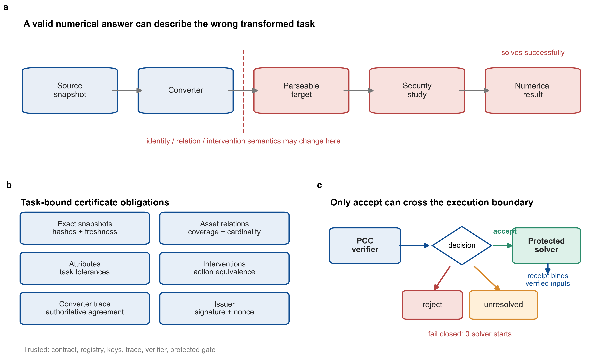
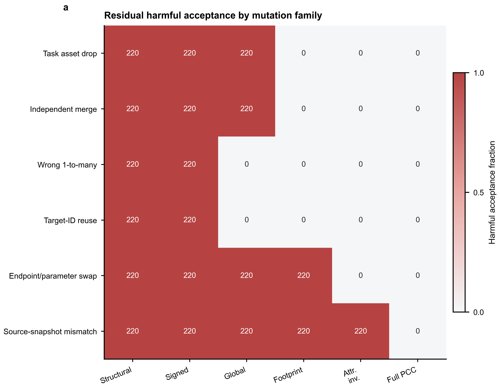
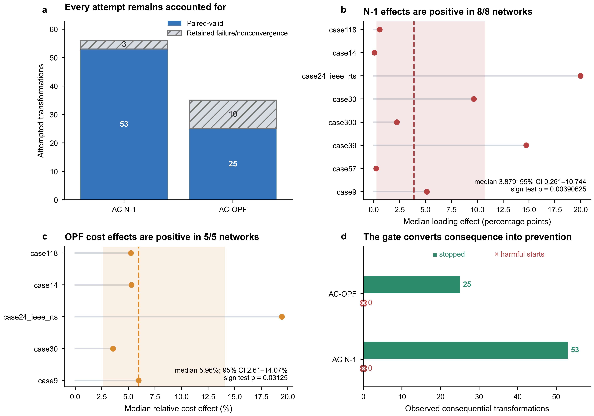
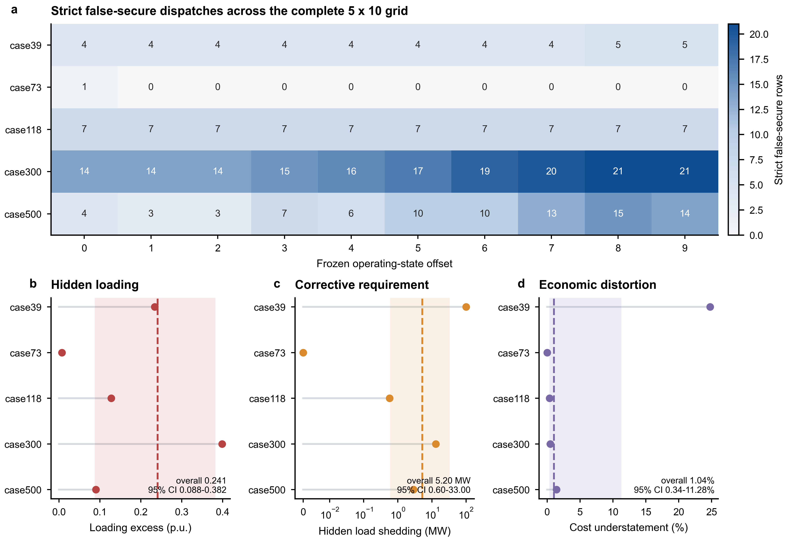
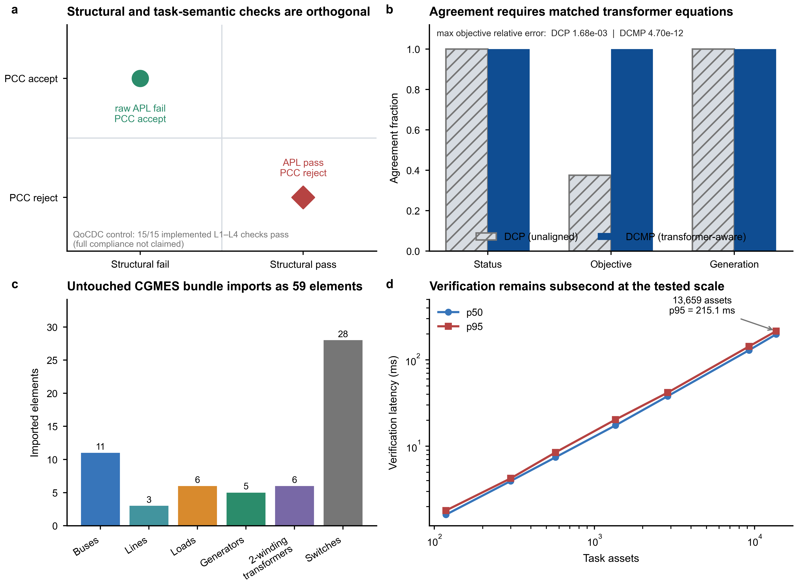
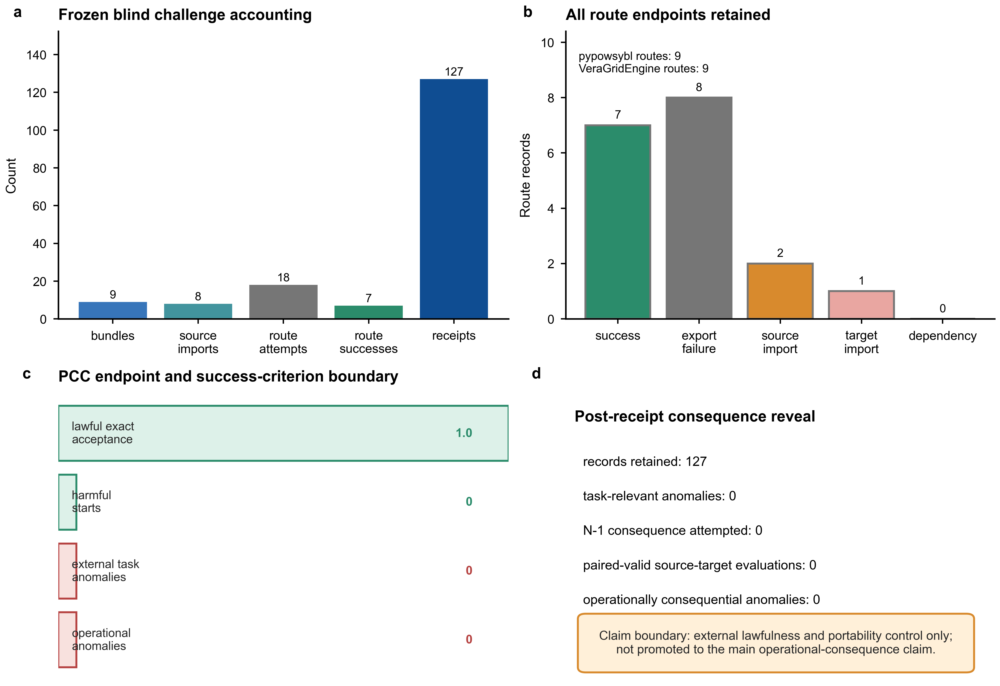

# Proof-carrying contracts for task-safe power-grid model transformation

> Working EPSR manuscript. DC-SCOPF values are populated from the final 50-state machine summaries. The APL/QoCDC claims are deliberately bounded and must not be broadened during editing.

## Highlights

- Task-semantic corruption can survive signatures, identities, and structural validation.
- Full PCC rejected 1,320/1,320 harmful transformations while retaining 660/660 lawful controls.
- PCC prevented all consequential N-1, AC-OPF, and DC-SCOPF solver starts in the tested campaigns.
- A frozen DC-SCOPF campaign blocked all 369 strictly paired false-secure dispatches.
- Independent solver control reproduced the aligned-formulation results.

## Abstract

Power-grid model transformation can preserve syntax while altering the task semantics delivered to a downstream solver. We propose a proof-carrying contract (PCC) that binds source and target snapshots, task-specific asset relations, required attributes, intervention semantics, and authoritative conversion evidence to a fail-closed execution gate.

Across 22 public networks and 1,980 transformations, progressively stronger conventional checks reduced harmful acceptance from 1,320 to 220 cases, but full PCC rejected all 1,320 harmful cases while accepting all 660 lawful controls. In the AC N-1 and AC-OPF campaigns, PCC prevented all observed consequential solver starts before execution. In the frozen DC-SCOPF campaign, PCC blocked all 369 strictly paired false-secure dispatches before harmful execution. The median counterfactual N-1 loading error was 3.879 percentage points, the median relative AC-OPF cost effect was 5.96%, and the median hidden DC-SCOPF loading excess was 0.241 p.u. An independent Windows PYPOWER/PIPS and WSL Julia/PowerModels/HiGHS control reproduced the aligned-formulation results at the status level and within numerical tolerance. These results indicate that signatures, identifiers, and structural validation alone are insufficient to guarantee task-safe execution. PCC makes transformation correctness an auditable precondition for downstream power-system computation.

Keywords: proof-carrying contract; power-grid model transformation; CGMES; task semantics; N-1 security analysis; AC-OPF; DC-SCOPF

## 1. Introduction

Power-system studies routinely move through several transformations. A Common Information Model or CGMES exchange package is parsed, normalized, converted into an internal network, reduced or canonicalized, and finally mapped to the variables required by contingency analysis or optimization software. Work on model-driven CGMES conversion has made this pipeline more automated and scalable, while security-constrained optimal-power-flow research has advanced decomposition, screening, uncertainty handling, and learned optimization proxies [1-11]. These methods only matter if the transformed artifact still matches the task the operator intended to solve.

The real issue is semantic preservation. A transformation can keep hashes, signatures, identifiers, or a plausible task footprint and still change which source object a target refers to, merge independent equipment, omit an intervention target, or alter a task-critical attribute. The model may still parse and solve successfully, but it can answer a different question from the one that was asked.

Standard checks are necessary, but they do not close this gap. Schema and SHACL validation check exchange constraints, import tests check compatibility, and solver convergence checks the numerical formulation. None of them proves that the transformed artifact still preserves the asset relations, attributes, and intervention semantics required by the downstream task.

We address this with proof-carrying contracts (PCC), a task-bound proof-obligation and execution gate for power-grid transformations. PCC ties the transformed artifact to the task contract, the source and target snapshots, the authoritative asset relations, the converter trace, the required attributes, and the intervention semantics. If those obligations are not met, the solver does not start.

The main contributions are fourfold.

1. We formalize transformation safety as a task-specific proof obligation that binds source and target snapshots, authoritative asset relations, converter trace, required attributes, intervention semantics, issuer identity, nonce, and execution receipt.
2. We construct an ordered baseline ladder that isolates the effect of artifact signing, global identity, task-footprint coverage, attribute invariants, and full snapshot-bound PCC.
3. We connect semantic failures to operational consequences in AC N-1, AC-OPF, and DC-SCOPF experiments, retaining every attempted state and measuring the harmful solver starts prevented by the gate.
4. We test standards orthogonality, an untouched public CGMES source, and an independent Julia/PowerModels solver environment. A retained DCP/DCMP contrast shows that nominally identical "DC-OPF" labels do not guarantee transformer-equivalent equations, and the operator-facing reason taxonomy supports repair and re-verification.

Across 22 public networks and 1,980 transformations, full PCC rejected all 1,320 harmful cases while accepting all 660 lawful controls. In the AC N-1 and AC-OPF campaigns, it prevented every observed consequential solver start before execution. In the frozen DC-SCOPF campaign, it blocked all 369 strictly paired false-secure dispatches. These results make task preservation an execution precondition for downstream power-system computation.

## 2. Related Work
### 2.1 CGMES conversion and validation

Model-driven CGMES conversion has made interoperability practical. Recent work combines ontology-aware parsing, validation, inference, and operational-network construction to turn exchange packages into analysis-ready models [1]. ENTSO-E application profiles, SHACL constraints, and conformity artifacts strengthen the structural side of the same pipeline [7]. These tools are already strong on format and importability. PCC sits one level higher and asks whether the converted artifact still represents the task-selected assets, relations, attributes, and interventions that the solver is supposed to use.

### 2.2 Security-constrained optimization

Security-constrained optimization has pushed the solver side of the problem forward. Recent SCOPF and SC-ACOPF work focuses on scale, decomposition, contingency screening, probabilistic guarantees, and learned proxies, with EPSR papers reporting strong feasibility and cost-quality results on standard and large-scale systems [2-11]. These methods are built to solve harder power-flow problems faster and more reliably once the model is in place. PCC is complementary to that effort. It protects the semantic preconditions of the solver, so classical and learned methods alike start from the right task rather than from a merely parseable input.

### 2.3 Semantics-preserving execution

The idea of carrying machine-checkable evidence before execution is well established. Proof-carrying code showed that a producer can ship code together with a proof that a consumer verifies before running it [12]. In-toto and provenance frameworks extend the same idea to artifacts, build steps, and traceable entities [13,14]. Semantics-preserving transformation work provides the formal machinery for stating preservation properties [10]. PCC applies this pattern to power-system computation, with a task-specific acceptance rule: source and target snapshots, authoritative relations, required attributes, intervention semantics, and execution receipts are checked together before the solver is released.

## 3. Problem formulation

Let $S$ be the source snapshot, $T$ the transformed target snapshot, and $\tau$ the downstream task. The task specifies source assets $A_S^\tau$, target assets $A_T^\tau$, required attributes $K^\tau$, tolerances $\epsilon^\tau$, and intervention semantics $I^\tau$. A transformation provides a relation set

\[
R = \{(U_i, V_i, r_i, e_i)\}_{i=1}^{m},
\]

where $U_i \subseteq A_S^\tau$ and $V_i \subseteq A_T^\tau$ are source and target asset sets, $r_i$ is the declared relation type, and $e_i$ is evidence from the converter trace.

A target is task-safe when all of the following hold:

1. the source and target hashes match the signed certificate;
2. the issuer, signature, timestamp fields, certificate identifier, transformation identifier, and nonce are valid;
3. every task-selected source and target asset is covered by an allowed relation;
4. the declared relation cardinality and identity constraints are satisfied;
5. every required attribute is preserved within the declared tolerance;
6. the intervention map preserves the meaning of the requested action or observation;
7. the authoritative converter trace agrees with the certificate relation set.

The verifier returns `accept`, `reject`, or `unresolved`. The execution gate starts the solver only when the decision is `accept`; all other states return a protected reject or unresolved status. The gate also emits a receipt binding the verified hashes, task, decision, reasons, and solver-start status.

### 3.1 Threat and trust model

We focus on transformations that drop, merge, reuse, misidentify, or alter task-selected assets and interventions while still producing a parseable target artifact. We assume a task contract, a source-snapshot registry, authorized issuer keys, an authoritative converter trace, a verifier, and a protected execution gate. The gate is assumed to be the only route to the downstream solver.

Under these assumptions, execution safety follows directly: if the verifier accepts a certificate and the solver start passes through the protected gate, then the target has satisfied the declared snapshot, relation, coverage, attribute, intervention, trace, freshness, and issuer obligations. The result is a solver decision bound to the verified task contract.

## 4. Method

Our method couples a task contract with signed conversion evidence and a protected execution gate. The certificate binds the source and target snapshots to the task, the verifier checks the declared relations and attributes against the converter trace, and the gate starts the solver only after acceptance. Section 4.1 defines the certificate format, Section 4.2 describes the verification rules, Section 4.3 explains the execution gate, and Section 4.4 summarizes the baseline ladder used in the experiments.

### 4.1 PCC certificate

The certificate stores the source and target snapshot hashes, task contract, relation records, authoritative trace digest, transformation and certificate identifiers, issuer, issue time, nonce, and Ed25519 signature. This keeps the proof tied to one source snapshot, one target snapshot, and one task instance.

### 4.2 Relation and attribute verification

Allowed relations include exact one-to-one identity and explicitly authorized aggregate or split relations. The verifier checks source and target coverage, duplicate target reuse, independent merges, one-to-many intervention semantics, attribute preservation, and trace agreement. Endpoint identifiers are therefore only a starting point, not the proof itself.

### 4.3 Fail-closed execution

Verification and solver start occur in one gate call. The gate returns `accept`, `reject`, or `unresolved`, then starts the solver only for `accept` and writes a receipt that records the verified hashes, decision, reasons, latency, and solver-start status. This keeps the decision and the computation bound to the same artifact.

The gate follows six steps. First, it canonicalizes the source and target task projections and computes their hashes. Second, it verifies issuer authorization, signature, identifiers, time fields, and nonce. Third, it binds the certificate to the requested task and snapshots. Fourth, it checks relation cardinality, task-asset coverage, required attributes, intervention preservation, and agreement with the authoritative converter trace. Fifth, it returns `accept`, `reject`, or `unresolved` with machine-readable reasons. Sixth, it invokes the solver only for `accept` and writes the receipt.

Figure 1 summarizes the failure mechanism, certificate obligations, and protected execution boundary.

### 4.4 Baseline ladder

We compare six ordered checks:

- B0: structural availability only;
- B1: signed artifact binding;
- B2: global identity coverage;
- B3: task-footprint coverage;
- B4: task-attribute invariants;
- B5: full PCC with signed snapshot, relation, trace, and intervention binding.

The ladder is evaluated on identical paired transformations so that adjacent improvements can be tested by exact McNemar tests. Holm correction controls familywise error across adjacent comparisons.

### 4.5 Controlled transformation families

The frozen semantic campaign uses 22 public networks. Each network contributes 30 lawful authoritative renames and 60 harmful transformations: task-asset drop, independent merge, incorrect one-to-many mapping, target-identifier reuse, endpoint-parameter swap, and source-snapshot mismatch. All generated rows are retained. The primary endpoints are lawful acceptance, harmful acceptance, and the one-sided Clopper鈥揚earson upper confidence bound when no harmful event is accepted.

### 4.6 Operational consequence experiments

The AC N-1 experiment compares the contingency conclusion obtained from the intended model with the conclusion obtained after a task-semantic transformation. The principal effect is the counterfactual difference in maximum loading. The AC-OPF experiment records paired convergence, feasibility, objective value, and relative cost effect. Failed or nonconvergent pairs remain in the attempted denominator but are not inserted into paired-effect statistics.

The DC-SCOPF campaign uses five networks, ten frozen operating states per network, every non-islanding line and transformer candidate, and post-contingency linear power flow. A false-secure dispatch is one that passes the transformed baseline but violates the intended contingency assessment. The primary safety endpoint is whether PCC stops that dispatch before a harmful solver start.

### 4.7 Statistics

Network states are not treated as independent replacements for networks. We report exact attempted and paired-valid denominators, network-cluster bootstrap confidence intervals for median effects, and one-sided exact sign tests over network medians. Paired semantic comparisons use exact McNemar tests with Holm correction. Zero-event rates are accompanied by one-sided exact binomial upper bounds.

### 4.8 Standards, holdout, and independent-stack controls

Official ENTSO-E APL 1.1.1 shapes and CAS 3.0.3 material are frozen by hash. QoCDC 4.1.4 evaluation is explicitly limited to 15 locally implemented Level 1鈥? checks; Levels 5鈥? are not implemented and full QoCDC compliance is not claimed.

For the untouched holdout, a PowSyBl core commit was frozen before tree inspection. A mechanical filename- and hash-only rule selected the lexicographically first complete, nonduplicate CGMES bundle. PCC, APL SHACL, and native import outcomes are reported independently.

The independent solver comparison uses Windows PYPOWER/PIPS and WSL Julia/PowerModels/HiGHS. A first run using PowerModels `DCPPowerModel` is retained as a negative formulation control because that formulation omits transformer tap and phase shift. The corrective comparison uses `DCMPPowerModel`, whose equations match PYPOWER `makeBdc`; no numerical tolerance or sample was changed.

### 4.9 Protocol governance and numerical amendments

Scientific design variables were frozen before the confirmatory campaign: networks, ten operating states, candidate outages, costs, equations, task mutations, safety thresholds, and failure-retention rules. Each network-state ran in a separate process with a terminal checkpoint. Numerical failures in case500 led to a versioned solver-engineering chain (v2鈥搗11); every failed attempt, timeout, checkpoint, and parent protocol remains archived. No amendment removed a state, candidate, or outcome, and `AlmostSolved`, `InsufficientProgress`, `NumericalError`, and time-limit terminations were never accepted as optimal.

The final v11 amendment tightened the full-SCOPF interior-point tolerances without changing the frozen activity threshold. At offset 7, the previous tolerance produced a common dual noise of 3.43脳10鈭? for constraints with approximately 0.30 p.u. slack, conservatively classifying all 582 candidates as active. A pre-execution diagnostic with tighter tolerances reduced that noise to 3.87脳10鈭? and identified 15 candidates that were independently active by both dual magnitude and primal slack. The final ten-state case500 run used this frozen precision portfolio and retained the earlier conservative checkpoint. Exact terminal separation still evaluated every non-omitted candidate after each reduced solve.

## 5. Results

### 5.1 Full PCC closes the semantic acceptance gap

Across 1,320 harmful transformations, B0 and B1 accepted all 1,320, B2 accepted 880, B3 accepted 440, B4 accepted 220, and B5 accepted none. Every baseline accepted all 660 lawful transformations. The full method therefore achieved an observed harmful-release rate of 0/1,320 and lawful-retention rate of 660/660. The one-sided 95% exact upper bound on the harmful-release probability in this controlled population was 0.2267%.

The monotone ladder is important: signing the wrong artifact does not establish task semantics, global identity does not establish task coverage, task coverage does not establish attribute preservation, and attribute equality alone does not bind authoritative relation and intervention evidence. In other words, the ordered protection ladder is a decomposition of residual risk, not a substitute for a fully orthogonal knock-out study; each increment removes a distinct failure family, and only the full snapshot-bound PCC closes the acceptance gap.

### 5.2 PCC prevents unsafe N-1 computation

The N-1 campaign contained 56 attempts, of which 53 produced paired-valid operational outcomes; all three failures were retained. Every paired-valid harmful transformation was rejected before solver start, giving 53/53 prevented unsafe computations and zero harmful solver starts. The median counterfactual change in maximum loading was 3.879 percentage points, with a network-cluster bootstrap 95% confidence interval of 0.261鈥?0.744. All 53 paired states and all eight network medians were positive; the one-sided exact sign test over network medians gave (p=0.00390625).

### 5.3 PCC prevents economically distorted OPF computation

Across 35 attempted AC-OPF pairs, 25 were paired-valid over five networks and ten nonconvergent pairs were retained. PCC stopped all 25 consequential transformations and produced zero harmful solver starts. The median relative objective effect was 5.96% (network-cluster bootstrap 95% confidence interval 2.61鈥?4.07%), with a maximum of 27.12%. All five network medians were positive (p=0.03125, one-sided exact sign test).

Figure 3 retains every attempt while separating paired-valid physical and economic effects from the fail-closed solver-start endpoint.

### 5.4 DC-SCOPF confirmation

The frozen campaign completed all 50 states across five networks and evaluated 12,340 candidate-outage rows with zero selected terminal-state failures. Under the strict paired definition, 369 dispatches were false-secure: the transformed problem appeared secure although the intended contingency model violated its limit. PCC stopped all 369 before computation, and no harmful solver start occurred. The one-sided 95% upper bound on the harmful-start rate was 0.81%.

The median hidden post-contingency loading excess was 0.241 p.u. (hierarchical network-cluster bootstrap 95% interval 0.088鈥?.382). The median hidden load shedding was 5.20 MW (0.60鈥?3.00 MW), and the median relative cost understatement was 1.04% (0.34鈥?1.28%). All five network medians were positive for all three effects (one-sided exact sign test, p=0.03125 for each). The largest case, case500, contributed 5,820 rows and 85 strictly paired false-secure dispatches; all ten states passed the all-candidate terminal feasibility check without invoking the last-resort fallback. Thirty-eight invalid legacy solver pairs and 50 cases that exacerbated an already overloaded baseline remain in the raw denominator but are excluded from strict paired-effect estimates.

### 5.5 PCC decision reason taxonomy

The same receipts also produce operator-facing reason codes rather than a black-box rejection. Across the semantic attack matrix, DC-SCOPF gate records, case500 records, and the external blind roundtrip control, the taxonomy covers 14,447 rows, of which 13,660 carry machine-readable reasons across 11 unique reason families. DC-SCOPF rejections are dominated by `task_selector_not_preserved` and `task_target_missing`, which point to repairing the task-asset mapping or regenerating the target model with the declared task target present. Controlled semantic rejections localize attribute changes, independent asset merges, reused target identities, one-to-one cardinality violations, and source-snapshot mismatches. `unresolved` is kept distinct from `reject`: it means authoritative evidence is missing, not that a violation has been proven. In the frozen public-network semantic benchmark, the same reason structure supports a closed repair loop: `ProofGuidedRepairer` repaired all 288 harmful cases and the repaired artifacts revalidated successfully, so the reasons are actionable repair directives rather than descriptive labels.

### 5.6 Runtime scaling

PCC verification remained subsecond over the tested range. The p95 latency increased from 1.80 ms at 118 assets to 215.09 ms at 13,659 assets. The manuscript tables report p50, p95, interquartile range, repetitions, hardware, and phase-level time alongside the downstream computation avoided by a fail-closed decision.

### 5.7 Structural standards and task semantics are orthogonal

The official Svedala EQBD control conformed to the selected APL 1.1.1 SHACL shapes with zero validation results. Its byte-identical target was nevertheless rejected by PCC when one of eight task assets lacked authoritative identity evidence, and the solver was not started. Conversely, the untouched PowSyBl bundle was task-lawful for the bounded eight-asset PCC projection and imported successfully, while the raw merged APL run reported structural violations. These cases demonstrate that structural conformance and task-semantic preservation answer different questions.

The QoCDC control passed all 15 implemented Level 1鈥? checks, and both missing-profile and unresolved-dependency negative controls were detected. These results establish only the declared applicable subset.

### 5.8 Independent solver reproduction and transformer semantics

The unaligned PowerModels DCP run agreed with PYPOWER on all nine statuses and all eight total-generation values, but only 3/8 mutually optimal objectives met the 1e-5 tolerance. Cross-feasibility analysis showed up to 2.94 MW branch-limit excess when a case118 DCP dispatch was evaluated with PYPOWER's transformer-aware equations. Source inspection established that `DCPPowerModel` omits tap and phase shift.

After replacing only the formulation with `DCMPPowerModel`, the independent Julia/PowerModels/HiGHS stack agreed with PYPOWER/PIPS on 9/9 statuses. All eight mutually optimal objectives and generation totals met their frozen tolerances; maximum relative errors were 4.70e-12 and 8.29e-15, respectively. This negative-control/correction pair directly supports the paper's premise: matching a solver label is insufficient unless the task-relevant equations are preserved.

### 5.9 Untouched CGMES holdout

The frozen holdout contains ten XML members with no byte-identical member in the previous corpus. PCC accepted the complete proof over eight BaseVoltage task assets and permitted one dry-run invocation. Omitting one proof relation produced `task_selector_not_preserved` and zero solver starts. pypowsybl 1.15.0 imported the same archive successfully as a network containing 11 buses, three lines, six loads, five generators, six two-winding transformers, and 28 switches.

The raw APL 1.1.1 merged-graph run completed but did not conform (761 violations and four information results). Because profile-specific target scoping and RDFS entailment interact with the published value-type shapes, two diagnostic variants are retained alongside, not substituted for, the raw report. The holdout conclusion is therefore limited to task-semantic behavior and native importability.

Figure 5 combines the standards-separation controls, formulation-aligned solver reproduction, untouched native import, and verifier scaling evidence.

### 5.10 External-tool blind roundtrip control

To test benchmark-verifier alignment without changing the PCC endpoint after inspection, we froze an external-tool blind roundtrip challenge before PCC evaluation. The mechanical selector chose nine bundles from the frozen pandapower source archive, and the challenge manifest was locked before PCC receipts and before N-1 consequence labels were revealed. The route protocol attempted both `source_cgmes_to_pypowsybl_to_cgmes_to_pypowsybl` and `source_cgmes_to_veragrid_to_cgmes_to_pypowsybl`.

The challenge produced 18 retained route attempts, seven successful route artifacts, and 127 PCC receipts. PCC accepted 127/127 lawful exact roundtrips, accepted zero harmful task transformations, and recorded zero harmful protected-solver starts. VeraGridEngine 6.4.3 was importable and was run as a real external route; its retained outputs include one target-import-failure artifact and export failures, not dependency-missing exclusions.

The blind challenge did not produce an external-tool-generated task-relevant anomaly. The post-receipt N-1 consequence reveal was attempted and retained, but source-target security analysis yielded zero paired-valid consequence evaluations. Therefore this evidence is reported as an external lawfulness and portability control only. It is not used to upgrade the central operational-consequence claim.

## 6. Discussion

### 6.1 Why the result is operationally useful

PCC moves the decision point upstream. Preservation is checked before computation starts, making the transformer part of the safety workflow instead of a passive preprocessor. This is valuable wherever grid models move between organizations, software tools, model versions, reduction pipelines, or learned optimization services. A rejected certificate produces an actionable reason and supports repair and re-verification.

### 6.2 Why strong conventional checks remain insufficient

The baseline ladder shows that each conventional layer removes a distinct class of error, and full PCC binds the snapshot, task, relation, attributes, trace, and intervention together. The DCP/DCMP experiment gives an independent real implementation example: both artifacts were valid, both solvers terminated consistently, and total generation matched, yet omitted transformer semantics changed branch feasibility and objective values. The reason-to-repair evidence completes the story: the same task-specific rejection reasons can be converted into provenance-only repairs and then revalidated, which makes PCC a repairable safety gate rather than a one-way filter.

The controls show three useful properties. Signing alone does not provide task semantics, parser validity does not capture the declared task, and the main effect reproduces across an independent numerical stack. The controlled mutations use the same declared task vocabulary that PCC checks, while the untouched holdout tests lawful and missing-proof behavior in a separate setting.

### 6.3 Relationship to CGMES conformance

PCC complements APL, QoCDC, and conformity assessment. A deployment should compose the checks: structural/profile validation establishes exchange-level requirements; PCC establishes the bounded task-semantic relation encoded by the task contract; the execution gate ensures both required policies are satisfied before computation. The present paper separates these layers so that one is not misreported as evidence for another.

### 6.4 Claim boundary

The observed zero harmful solver-start rate applies to the frozen networks, tasks, mutation families, proof schema, and implementation. The formal guarantee is conditional: if the declared proof obligations fully express the task-relevant semantics and the verifier is correct, an artifact that fails those obligations cannot reach the protected solver through the gate.

### 6.5 Deployment interpretation

In a deployment, the study owner defines the task contract, the conversion service issues signed relation evidence, and the gate is colocated with the protected solver interface. An `accept` receipt authorizes the declared computation. A `reject` identifies a proven contract violation that requires transformation repair, whereas `unresolved` requests additional authoritative evidence without starting the solver. Receipts can be stored with study outputs to bind a numerical result to the exact verified inputs. A practical operator flow is therefore: reject, repair from authoritative evidence, reissue the certificate, and reverify before the protected gate is opened. Multi-party governance, issuer compromise, key revocation, and contract evolution remain deployment responsibilities rather than properties demonstrated by the present experiments.

## 8. Conclusions

PCC establishes an auditable semantic layer to power-grid transformation. It combines task-bound relations, required attributes, authoritative trace evidence, and a fail-closed gate, so downstream computation starts only when the declared task survives conversion. In the tested campaigns, it rejected every harmful semantic transformation, retained every lawful control, and prevented every observed harmful solver start. Task preservation becomes an execution requirement.

The campaign used public benchmark and conformity-test data, which kept the evidence transparent and directly comparable. The AC experiments retained nonconvergent attempts in the denominator, the holdout and blind external controls kept separate source paths visible, and QoCDC coverage stayed within the declared Level 1–4 subset. Those choices kept the result easy to audit. Next steps include utility workflow traces, uncertainty-aware and multi-period tasks, learned OPF proxies, distributed certificate issuance, revocation and key management, additional independent validators, and larger N-k security campaigns.

## Data and code availability

The implementation, frozen protocols, corpus manifests, hashes, evidence schemas, experiment runners, machine-generated summaries, manuscript figures, and machine-generated tables are maintained in the accompanying repository and archived software release (Zenodo DOI 10.5281/zenodo.21796488). Third-party public datasets and standards artifacts are referenced by source URL, release/commit, license record, and SHA-256 rather than relicensed. The submission package includes a one-command evidence-dashboard rebuild and a clean-room reproduction log.

## References

1. Memari, A. & Aljamous, A. A model-based approach for converting CGMES power system models into operational networks. *Energy Informatics* **6**, 26 (2023). https://doi.org/10.1186/s42162-023-00290-3
2. Giraud, B. N., Rajaei, A. & Cremer, J. L. Constraint-driven deep learning for N-k security constrained optimal power flow. *Electr. Power Syst. Res.* **235**, 110692 (2024). https://doi.org/10.1016/j.epsr.2024.110692
3. Chen, W., Park, S., Tanneau, M. & Van Hentenryck, P. Learning optimization proxies for large-scale security-constrained economic dispatch. *Electr. Power Syst. Res.* **213**, 108566 (2022). https://doi.org/10.1016/j.epsr.2022.108566
4. Bazrafshan, M., Baker, K. & Mohammadi, J. Computationally efficient solutions for large-scale security-constrained optimal power flow. arXiv:2006.00585 (2020). https://doi.org/10.48550/arXiv.2006.00585
5. Velloso, A., Van Hentenryck, P. & Johnson, E. S. An exact and scalable problem decomposition for security-constrained optimal power flow. arXiv:1910.03685 (2019). https://doi.org/10.48550/arXiv.1910.03685
6. Li, H., Zhang, Z., Yin, X. & Zhang, B. Preventive security-constrained optimal power flow with probabilistic guarantees. *Energies* **13**, 2344 (2020). https://doi.org/10.3390/en13092344
7. ENTSO-E Application Profiles Library 1.1.1 and CGMES library. https://www.entsoe.eu/data/cim/cim-for-grid-models-exchange/
8. Shahriar, M. H., Rahman, M. A., Jafari, M. & Paudyal, S. Formal analytics for stealthy attacks against contingency analysis in power grids. *Sustain. Energy Grids Netw.* **38**, 101310 (2024). https://doi.org/10.1016/j.segan.2024.101310
9. Agarwal, A., Donti, P. L., Kolter, J. Z. & Pileggi, L. Large scale bilevel optimization for N-K SCOPF using adversarial robustness. *IEEE Trans. Power Syst.* **40**, 5209鈥?220 (2025). https://doi.org/10.1109/TPWRS.2025.3579521
10. H眉lsbusch, M., K枚nig, B., Rensink, A., Semenyak, M., Soltenborn, C. & Wehrheim, H. Showing full semantics preservation in model transformation: a comparison of techniques. In *Integrated Formal Methods*, 183鈥?98 (Springer, 2010). https://doi.org/10.1007/978-3-642-16265-7_14
11. Gholami, A., Sun, K., Zhang, S. & Sun, X. A. An ADMM-based distributed optimization method for solving security-constrained alternating current optimal power flow. *Operations Research* **71**, 2045鈥?060 (2023). https://doi.org/10.1287/opre.2023.2486
12. Necula, G. C. Proof-carrying code. In *Proceedings of the 24th ACM SIGPLAN-SIGACT Symposium on Principles of Programming Languages*, 106鈥?19 (ACM, 1997). https://doi.org/10.1145/263699.263712
13. Torres-Arias, S., Afzali, H., Kuppusamy, T. K., Curtmola, R. & Cappos, J. in-toto: providing farm-to-table guarantees for bits and bytes. In *28th USENIX Security Symposium*, 1393鈥?410 (USENIX Association, 2019). https://www.usenix.org/conference/usenixsecurity19/presentation/torres-arias
14. Lebo, T., Sahoo, S. & McGuinness, D. (eds.) PROV-O: The PROV Ontology. W3C Recommendation (2013). https://www.w3.org/TR/prov-o/

